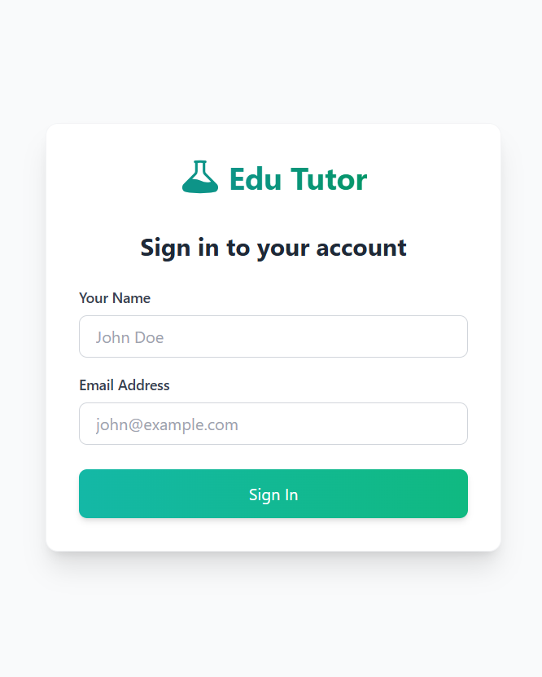
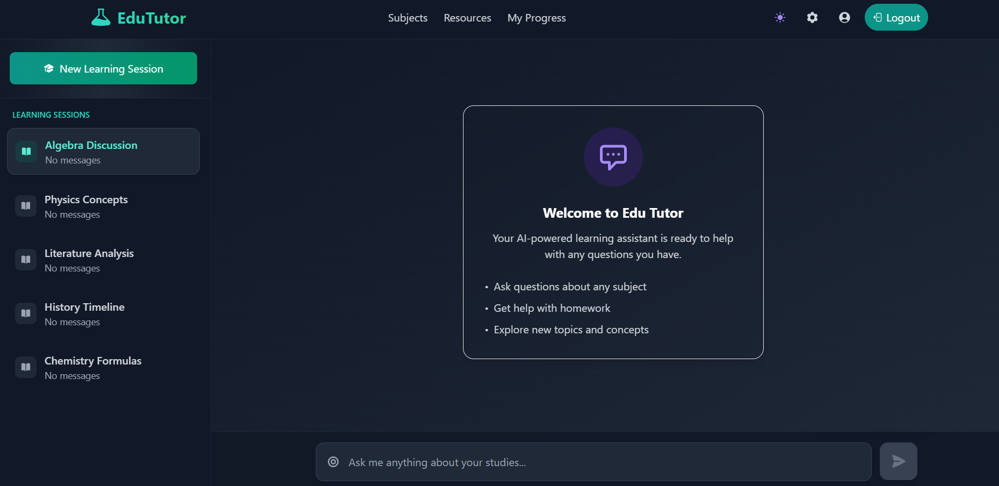
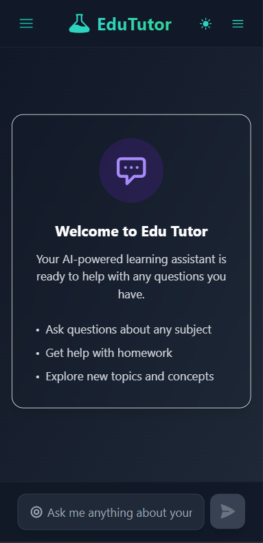

# Edu-Tutors: AI-Powered Educational Chat Application

**Edu-Tutors**, a dynamic, real-time chat application built with React.js that simulates AI-powered educational discussions. This application is designed as part of a **Coding Exercise** to showcase proficiency in modern web technologies and frameworks.

<p align="center">
  
  
  
  
</p>

## Overview

Edu-Tutors leverages the power of modern frontend technologies to deliver a seamless, high-performance, and intuitive learning experience. Users can engage in real-time conversations mimicking AI tutoring sessions, making the platform ideal for educational support, doubt resolution, and knowledge sharing.

## Tech Stack

- **Frameworks**: [React.js](https://reactjs.org/)
- **Language**: [JavaScript](https://www.javascript.com/)
- **State Management**: [Zustand](https://github.com/pmndrs/zustand) 
- **UI Libraries**: [TailwindCSS](https://tailwindcss.com/)
- **Version Control**: Git + GitHub

## Features

- Real-time AI-powered chat simulation
- Responsive UI with TailwindCSS
- Clean and scalable codebase with TypeScript
- State management using Zustand 
- Educational-focused conversation flows
- Optimized for performance and user experience

## Project Structure
```bash
Auro-Edu-Chat/
│
├── public/                             # Static assets (e.g., favicon, HTML images)
│
├── source/                             # Main source folder
│   ├── data/                           # Global state stores (e.g., Zustand)
│   │   ├── appearanceStore.js          # Theme & appearance state
│   │   ├── messageStore.js             # Chat message state
│   │   └── userStore.js                # User authentication/profile state
│
│   ├── elements/                       # Reusable UI components
│   │   ├── Messagelnterface.jsx        # Component to display messages
│   │   ├── SidePanel.jsx               # Sidebar for navigation
│   │   ├── TopBar.jsx                  # Top navigation bar
│   │   └── UserProfiIe.jsx             # User profile panel
│
│   ├── pages/                          # Application views/pages
│   │   ├── Login.jsx                   # Login screen
│   │   └── MainView.jsx                # Main chat screen layout
│
│   ├── utilities/                      # Utility functions and API logic
│   │   └── services.js                 # API setup and helpers (OpenRouter, etc.)
│
│   ├── App.jsx                         # Root component for the React app
│   ├── App.css                         # Component-level styles
│   ├── global.css                      # Global/custom styles
│   └── index.jsx                       # Entry point to the React app
│
├── static/                             # Any static files or public-facing data
│
├── .env.example                        # Environment variables (e.g., API keys)
├── .gitignore                          # Files/folders to ignore in Git
├── eslint.config.js                    # ESLint configuration
├── index.html                          # Main HTML template
├── package-lock.json                   # Auto-generated lockfile for npm
├── package.json                        # Project metadata and dependencies

```

## 🛠️ Getting Started

### 1. Clone the Repository

```bash
git clone https://github.com/VIKASRAPARTHI/Edu-Tutors.git
cd Edu-Tutors
```

### 2. Install Dependencies
```bash
npm install
  or
yarn install
```

### 3. Run the Development Server
```bash
npm run dev
  or
yarn dev
```

The application will be available at http://localhost:3000.

### Future Improvements
1. Backend WebSocket server integration
2. AI/LLM API integration for real conversations
3. User authentication and session tracking
4. Enhanced UI/UX with animations and transitions
5. Mobile-first improvements

### Contact
Made with ❤️ by Vikas Raparthi


